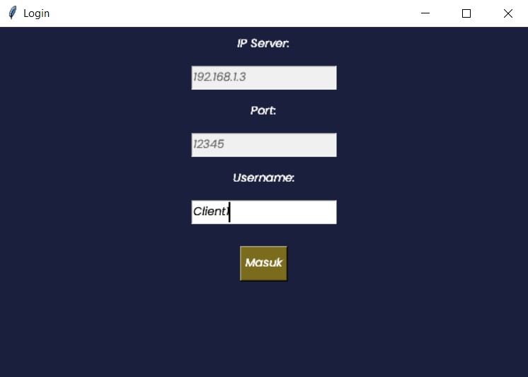
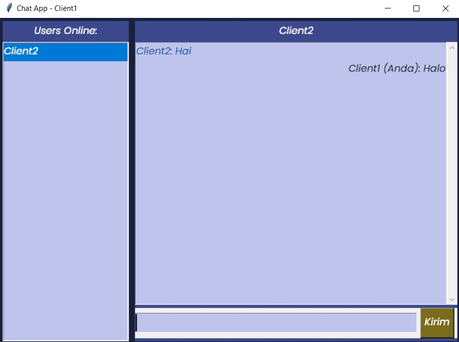
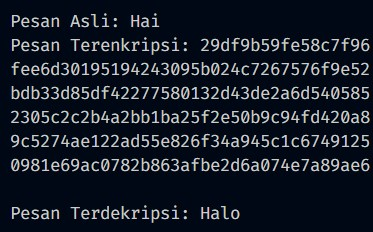

# Aplikasi Chat Sederhana dengan Enkripsi RSA dan Implementasi Kunci Publik dan Kunci Privat menggunakan Python

## Dependencies

 - Python >= 3.10.4
 - Tkinter
 - Socket
 
## Fitur

- Input username
- Pengguna bisa memilih untuk chatting dengan siapa
- Pesan dienkripsi dengan algoritma RSA 
- Mekanisme kunci publik dan kunci privat

## Cara Menjalankan
- Buka terminal di direktori projek
- Jalankan perintah 
    ```
    python server.py

    ```
- Buka terminal baru
- Jalankan perintah 
    ```
    python client.py
    
    ```
- Ulangi langkah 3- 4 sebanyak Client yang diinginkan
- Masukkan username lalu tekan tombol Masukkan

## Tampilan Aplikasi
<p>
  
  
  
</p>
